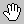

# PlainDraggable

The simple and high performance library to allow HTML/SVG element to be dragged.

**<a href="https://anseki.github.io/plain-draggable/">Document and Examples https://anseki.github.io/plain-draggable/</a>**

Features:

- Accept HTML/SVG element as an element that comes to be draggable.
- Restrict the draggable area.
- Snap the draggable element to other elements, points, lines, continuous points (i.e. grid) or something.
- Use `requestAnimationFrame` for high performance.
- Provide only basic methods, easy and simple usage.
- No dependency.
- Single file.
- Supports modern browsers.

## Usage

Load PlainDraggable into your web page.

```html
<script src="plain-draggable.min.js"></script>
```

This is simplest case:

```js
draggable = new PlainDraggable(element);
```

Now, the `element` can be moved by mouse-dragging operation.

By default, the moving is restricted to inside of the `element`'s parent element.

```html
<div class="gray">
  <div id="draggable">Drag This</div>
</div>
```

```js
draggable = new PlainDraggable(document.getElementById('draggable'));
```

The `<div id="draggable">` can be moved within the gray box. (See [`containment`](#options-containment) option.)

For options and more details, refer to the following.

## Constructor

```js
draggable = new PlainDraggable(element[, options])
```

The `element` argument is a HTML or SVG element that will be a draggable element. Any element that has a bounding-box is accepted. Other elements such as `<g>` can not specified.

The `options` argument is an Object that can have properties as [options](#options). You can also change the options by [`setOptions`](#setoptions) method or [properties](#properties) of the instance.

## Methods

### `setOptions`

```js
self = draggable.setOptions(options)
```

Set one or more options.  
The `options` argument is an Object that can have properties as [options](#options).

### `position`

```js
self = draggable.position()
```

Re-calculate the position of the draggable element, [`containment`](#options-containment) option and [`snap`](#options-snap) option, with current layout of a page.  
Tese are re-calculated as needed automatically when a window is resized, or a window or something is scrolled.  
You should call `position` method if you changed the layout without resizing the window or scrolling something.

## Options

### <a name="options-containment"></a>`containment`

| Type | Default |
|--|--|
| HTML/SVG element or [`Rect`](#rect) | Parent element |

A rectangle that restricts the draggable element moving. The draggable element can not move to outside this rectangle even if a mouse is moved to there.  
It can be a HTML or SVG element, or `Rect` object like `{left: '10%', top: 20, right: '90%', height: 300}` (See [`Rect`](#rect)). The base of the `Rect` object is the current document.  
Note that the rectangle is "padding-box" of the element if an element is specified. That is, it is the inside of borders of the element.

The default is the draggable element's parent element.

You can specify a `<body>` element that means all of a page, or `{left: 0, top: 0, width: '100%', height: '100%'}` means all of a document (the document height might differ from the `<body>` height).

### <a name="options-snap"></a>`snap`

| Type | Default |
|--|--|
| number, string, HTML/SVG element, [`Rect`](#rect), Array, Object or `undefined` | `undefined` |

See [Snap](#snap).

### <a name="options-handle"></a>`handle`

| Type | Default |
|--|--|
| HTML/SVG element | Draggable element |

A part element of the draggable element that receives mouse operations. A user seizes and drags this element to move the draggable element.  
The default is the draggable element itself, and all of the draggable element can be seized and dragged.

### <a name="options-zIndex"></a>`zIndex`

| Type | Default |
|--|--|
| number or `false` | `9000` |

A `z-index` CSS property that is applied to the draggable element when it is being dragged. It is restored when the dragging finished.  
If `false` is specified, it is not changed.

### <a name="options-left_top"></a>`left`/`top`

| Type | Default |
|--|--|
| number or `undefined` | `undefined` |

The distance between the top-left corner of the draggable element and the top-left corner of the document, in pixels.

It can be used for initial position when constructing. Also, it can be used to move the draggable element after constructing.  
For example, move it to rightward:

```js
draggable.left += 10;
```

### <a name="options-ondrag"></a>`onDrag`

| Type | Default |
|--|--|
| function or `undefined` | `undefined` |

A function that is called when the draggable element is about to be dragged.  
It is called even if the draggable is not moved because [`containment`](#options-containment) or [`snap`](#options-snap) avoided the moving. Use [`onMove`](#options-onmove) if you want to something the draggable element is moved.

In the function, `this` refers to the current PlainDraggable instance.

An Object that has `left` and `top` properties as new position is passed to the function. It is new position that the draggable element is about to go to. Thefore it might differ from a position of a mouse. These mean same as [`left`/`top`](#options-left_top) options.  
Also, `snapped` property is `true` if the position was determined by the draggable element being snaped (See [Snap](#snap)).

If the function returns `false`, the moving is canceled.

### <a name="options-onmove"></a>`onMove`

| Type | Default |
|--|--|
| function or `undefined` | `undefined` |

A function that is called when the draggable is moved.  
It is not called when the draggable is not moved because [`containment`](#options-containment) or [`snap`](#options-snap) avoided the moving even if the draggable element is dragged.

In the function, `this` refers to the current PlainDraggable instance.

### <a name="options-onmovestart"></a>`onMoveStart`

| Type | Default |
|--|--|
| function or `undefined` | `undefined` |

A function that is called when the moving the draggable starts after a mouse button is pressed.  
It is not called until the draggable element is moved even if it was dragged, and it is called at most once while a mouse button is being pressed.

In the function, `this` refers to the current PlainDraggable instance.

### <a name="options-ondragend"></a>`onDragEnd`

| Type | Default |
|--|--|
| function or `undefined` | `undefined` |

A function that is called when a mouse button is released.

In the function, `this` refers to the current PlainDraggable instance.

## Properties

### `disabled`

| Type | Default |
|--|--|
| boolean | `false` |

If `true` is specified, a moving the draggable element is stopped and the draggable element is not receive mouse operations.

### `element`

| Type |
|--|
| HTML/SVG element (*Read-only*) |

The element that was passed to [constructor](#constructor).

### <a name="properties-rect"></a>`rect`

| Type |
|--|
| [`Rect`](#rect) (*Read-only*) |

A `Rect` object to indicate current position and size of the draggable element.  
The base of the `Rect` object is the current document.

### Accessor Properties

Properties with the same name as each option to get or set following options:

- [`containment`](#options-containment)
- [`snap`](#options-snap)
- [`handle`](#options-handle)
- [`zIndex`](#options-zIndex)
- [`left`/`top`](#options-left_top)
- [`onDrag`](#options-ondrag)
- [`onMove`](#options-onmove)
- [`onMoveStart`](#options-onMoveStart)
- [`onDragEnd`](#options-onDragEnd)

### `PlainDraggable.draggableCursor`/`PlainDraggable.draggingCursor`

**Static Property**

| Type | Default |
|--|--|
| string or Array | `PlainDraggable.draggableCursor`:  (See below)<br>`PlainDraggable.draggingCursor`:  (See below) |

Default values (depend on web browser):
- `PlainDraggable.draggableCursor`: `['grab', 'all-scroll', 'move']` or `['all-scroll', 'move']` (For Webkit)
- `PlainDraggable.draggingCursor`: `['grabbing', 'move']` or `'move'` (For Webkit)

`PlainDraggable.draggableCursor` is a `cursor` CSS property that is applied to the [`handle`](#options-handle) element.  
`PlainDraggable.draggingCursor` is a `cursor` CSS property that is applied to the [`handle`](#options-handle) element while a mouse button is being pressed.

Note that the allowed values of the `cursor` CSS property depend on each web browser. Also, Webkit has a bug about the `cursor` CSS property, and the bug is being ignored a long time.  
If an Array that contains multiple values is specified, PlainDraggable tries it with each value until any of them succeeded.

If `false` is specified, it is not changed.  
If `false` is specified for both `PlainDraggable.draggableCursor` and `PlainDraggable.draggingCursor`, PlainDraggable does nothing to a `cursor` CSS property.

### `PlainDraggable.draggableClass`/`PlainDraggable.movingClass`

**Static Property**

| Type | Default |
|--|--|
| string | `PlainDraggable.draggableClass`: `'plain-draggable'`<br>`PlainDraggable.movingClass`: `'plain-draggable-moving'` |

`PlainDraggable.draggableClass` is a class name that is added to the [`handle`](#options-handle) element.  
`PlainDraggable.movingClass` is a class name that is added to the [`handle`](#options-handle) element within the period after the draggable element starts moving until a mouse button is released. Then, the draggable element has both classes.

## `Rect`

An Object to indicate a position and size of a rectangle. It has following properties:

- `left` or `x`
- `top` or `y`
- `width` or `right`
- `height` or `bottom`

All values can be a number as pixels or string as percentage like `'30%'`.

A "base" determines an origin for the `left`/`top`/`right`/`bottom`, and base values for percentage.

- When the `Rect` object is specified for [`containment`](#options-containment) option, the base is the current document.  
- When the `Rect` object is specified for [`snap`](#options-snap) option, the base is determined by [`base`](#snap-base) option.  
- When the `Rect` object is got by [`rect`](#properties-rect) property, the base is the current document.

The `x` is an alias for `left`, and the `y` is an alias for `top`. The `left`/`top`/`right`/`bottom` indicate distance between left or top edge of the base and each side of the rectangle. Note that `right`/`bottom` also indicate distance from left or top edge of the base, not right or bottom edge.  
The `width`/`height` indicate a size of the rectangle. The `right` is required if `width` is not specified, and the `bottom` is required if `height` is not specified.

Note that the `left` must be less than or equal to `right`, and the `top` must be less than or equal to `bottom`. In other words, the `width` and `height` can not be negative value. PlainDraggable does not exchange these, to avoid behavior that you don't want. For example, `{left: 400, right: '50%'}` is ignored when the base is resized to smaller than `800px`.

For example, when the base is an element that sized `width: 600px; height: 400px;`:
- `{left: 20, top: '10%', width: '50%', bottom: 390}` indicates a rectangle that is `left: 20px; top: 40px; width: 300px; height: 350px;`, positioned relative to the top-left corner of the element.
- `{left: '50%', top: 0, width: '50%', height: '100%'}` indicates a rectangle that is the right half of the element.
- `{left: '10%', top: '10%', right: '90%', bottom: '90%'}` indicates a rectangle that has `10%` margin at all sides.

## Snap

You can specify [`snap`](#options-snap) option.  
It makes one or more "snap targets". The draggable element gravitates toward a snap target when it is moved to near the snap target, and it sticks to the snap target.

Each snap target can be one of the following:

- Point
- Line
- Element
- [`Rect`](#rect) object

The point and line are the basic of snap target. The element and `Rect` object make multiple lines.

Single value creates a point that the value indicates both X and Y coordinates of the point.

```js
draggable.snap = 160; // Point (X: 160px, Y: 160px)
```

A value as coordinate can be a number as pixels or string as percentage like `'30%'`. The percentage works same as that of [`Rect`](#rect).  
For example, this indicates the center of the base.

```js
draggable.snap = '50%'; // Point (X: 50%, Y: 50%) i.e. the center
```

An Object that has `x` and `y` properties creates a point that the properties indicate coordinates of the point.

```js
draggable.snap = {x: 160, y: '40%'}; // Point (X: 160px, Y: 40%)
```

That is, something that does not have both `x` and `y` is regarded as the same one for both `x` and `y`.

An Object that has either one of `x` and `y` properties creates a line that the property indicates a coordinate on the axis. By default, the line has full length of size of the base.

```js
draggable.snap = {y: 30}; // Horizontal Line (Y: 30px)
```

The other property can be an Object that has one or both of `start` and `end` properties that indicate a coordinate on the axis. This Object indicates the range and length of the line.

```js
draggable.snap = {x: '50%', y: {start: 5, end: '50%'}}; // Vertical Line (X: 50%, Y: 5px .. 50%)
```

Note that the `start` must be less than or equal to `end`. PlainDraggable does not exchange these, to avoid behavior that you don't want. For example, `x: {start: 400, end: '50%'}` is ignored when the base is resized to smaller than `800px`.

A `step` property of the Object copies the point or line repeatedly at specified intervals. This may be called "Grid". It can be also grid on only either one of X and Y axis.

```js
draggable.snap = {step: 30}; // Continuous Points at 30px intervals
```

```js
draggable.snap = {x: {step: 10}, y: {step: 20}}; // Continuous Points at X: 10px and Y: 20px intervals
```

```js
draggable.snap = {y: {step: '10%'}}; // Continuous Horizontal Lines at 10% intervals
```

```js
draggable.snap = {y: {step: '10%', start: 5, end: '50%'}}; // Continuous Lines in specified range
```

An element or a [`Rect`](#rect) object creates four lines that are edges of its rectangle.

```js
draggable.snap = document.getElementById('snap-box'); // Element
```

```js
draggable.snap = {left: '10%', top: 0, width: '80%', height: 280}; // Rect object
```

The base of the `Rect` object is determined by [`base`](#snap-base) option.

You can specify options for the snap via properties of the Object that is passed to the `snap` option, or an Object instead of something that is not Object. For example, you can specify `{x: 80, y: 80, gravity: 30}` instead of `80` to specify the [`gravity`](#snap-gravity) option.

For options and more details, refer to the following.

### Structure and Omission

Actuary, you saw omitted structure of a `snap` option in the above.  
A basic structure of a `snap` option is here:

`SnapOptions`:

```js
{
  targets: [snapTarget1, snapTarget2...], // `SnapTarget`s
  option1: optionValue1, // Common options for all `SnapTarget`s
  option2: optionValue2,
    :
}
```

`SnapTarget`:

```js
{
  x: xValue, // number, string or Object that can have `start`, `end` and `step`
  y: yValue,
  target: elementOrRect, // Element or Rect object
  option1: optionValue1, // Options for this `SnapTarget`, override common option
  option2: optionValue2,
    :
}
```

The `x` and `y` can be a number as pixels, string as percentage like `'30%'` or Object. The Object can have `start`, `end` and `step` properties, and these properties can be a number as pixels or string as percentage like `'30%'`.

If both `x` and `y` are not Object, this `SnapTarget` is a point, and these properties indicate coordinates of the point.

If either one of `x` and `y` is an Object that does not have `step`, this `SnapTarget` is a line. The property that is not Object, the `start` and `end` properties of the Object indicate a coordinate on each axis. Then the Object indicates the range and length of the line.

